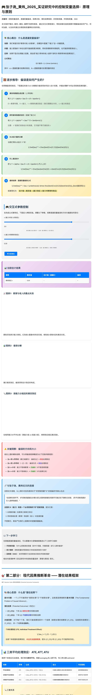
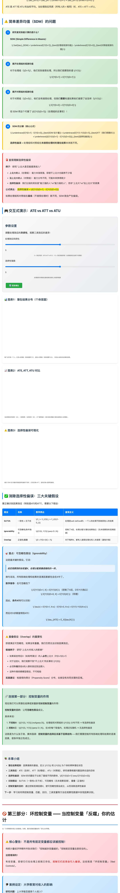
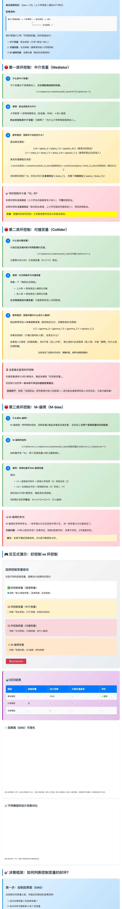
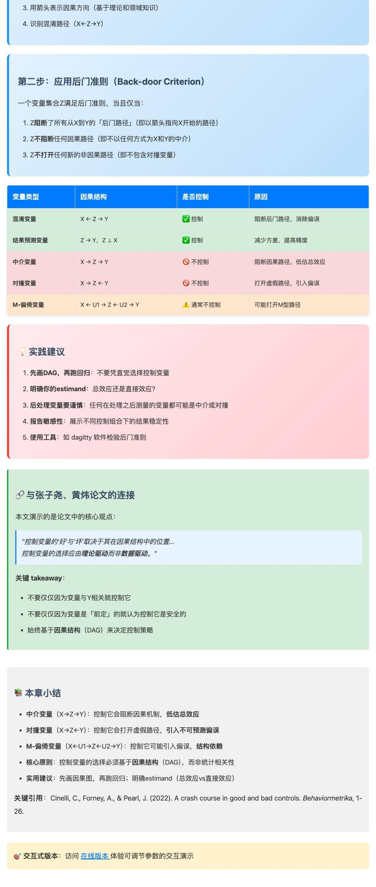

> 📚 **基于张子尧、黄炜（2025）《实证研究中的控制变量选择：原理与原则》...**

---

🎯 **阅读完整交互版**：点击"阅读原文"体验可调节参数的在线版本

📮 **关注本公众号**，获取更多社会学研究方法干货

💻 **GitHub 仓库**：[社会学读书笔记](https://github.com/jinyanghe1/sociology-notes)

---

*本文为自动生成，原始内容基于交互式教学网页*
